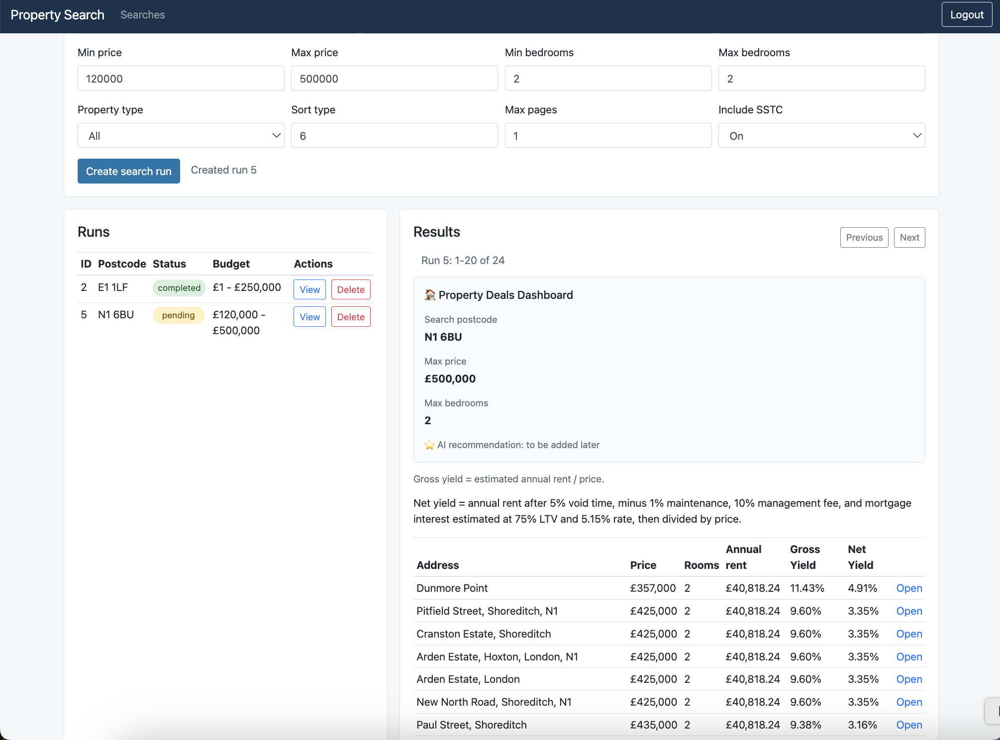

# Property Search Platform

Property search platform for scraping UK sale and rental listings, comparing search results, and calculating rental yield estimates.



Live app: https://property-search-platform.onrender.com/

API docs: https://property-search-platform.onrender.com/docs

## Demo

[Watch the demo video](https://github.com/mariyade/property-search-platform/raw/main/docs/demo.mp4)

<video src="docs/demo.mp4" controls width="75%"></video>

## Table of Contents

- [Background](#background)
- [AI Evaluation](#ai-evaluation)
- [Scope](#scope)
- [Technology](#technology)
- [Architecture](#architecture)
- [Data Sources](#data-sources)
- [Data Storage](#data-storage)
- [File Hierarchy](#file-hierarchy)
- [Pre-requisites](#pre-requisites)
- [Getting Started](#getting-started)
- [Testing and Linting](#testing-and-linting)
- [Testing Approach](#testing-approach)
- [Deployment](#deployment)

## Background

This project is a proof of concept evolving into a small MVP for property search and rental yield analysis. The application lets a user register, log in, create a property search, and receive calculated yield results after the scraping and analysis pipeline finishes.

The key design goal is to keep slow scraping and data processing outside the web request. FastAPI creates a search run quickly, Redis queues the background job, and a Celery worker processes the search asynchronously.

## AI Evaluation

This project includes a small proof of concept for testing and evaluating an
LLM-powered deal-analysis agent. The deal agent:

- Analyses visible search results for a completed property search run
- Validates request and response data with Pydantic
- Checks input guardrails for prompt injection and secrets
- Calls tools for yield metrics, risk flags, net-yield calculations, and RAG retrieval
- Uses LangChain, OpenAI embeddings, and ChromaDB to retrieve local methodology notes
- Returns a structured explanation validated with Pydantic

If the LLM response is malformed JSON or does not match the expected Pydantic schema,
the API returns an agent error instead of using an invalid answer.

## Scope

The current product flow focuses on user-submitted UK property searches.

A search run stores criteria such as:

- postcode or search location
- Rightmove location identifier
- search radius
- property type
- price range
- bedroom range
- maximum number of pages to scrape

The MVP supports:

- user registration and login
- JWT-based authentication
- creating search runs from a web form
- background scraping of sale and rental listings
- cleaning raw listing data
- calculating estimated annual rent, gross yield, and net yield
- viewing paginated results in the UI
- linking back to the original source listing

## Technology

The project is developed using Python.

- **Web framework:** FastAPI
- **Frontend:** Jinja2 templates, Bootstrap, JavaScript
- **Background processing:** Celery
- **Message broker:** Redis
- **Database:** PostgreSQL
- **Migrations:** Alembic
- **ORM / SQL toolkit:** SQLAlchemy
- **Scraping:** Requests, BeautifulSoup
- **Data processing:** Pandas
- **Containerization:** Docker, Docker Compose
- **Deployment:** Render
- **Testing:** Pytest, Playwright
- **AI evaluation:** DeepEval, OpenAI, LangChain, ChromaDB, Pydantic
- **Linting and formatting:** Ruff

## Architecture

The application uses separate services for web requests, background work, queueing, and storage.

```text
User
  |
  v
FastAPI Web Service
  |
  | creates search_run
  v
PostgreSQL
  |
  | queues task with search_run_id
  v
Redis
  |
  v
Celery Worker
  |
  | scrapes, cleans, calculates yields
  v
PostgreSQL
  |
  v
FastAPI UI/API returns results
```

FastAPI is responsible for user-facing requests. Celery is responsible for slow pipeline work. Redis acts as the queue between them. PostgreSQL stores users, search runs, raw listings, cleaned listings, and calculated yield results.

## Data Sources

The application currently scrapes property listing pages based on user-provided search criteria.

- **Sale listings:** used as candidate purchase properties
- **Rental listings:** used to estimate average rent for matching postcode and room count
- **Stamp duty and cost assumptions:** calculated in code using embedded assumptions

The source listing link is stored with each result so users can open the original property page.

### Search Creation

The user submits a search form through the web UI. FastAPI validates the request, stores it in the `search_runs` table, and sends a Celery task to Redis.

```text
POST /search-runs/
  -> create search_runs row
  -> process_search_run.delay(search_run.id)
```

### Background Processing

The Celery worker picks up the queued task and runs the search pipeline:

1. Mark the search run as `running`
2. Build sale search filters
3. Scrape sale listings
4. Build rental search filters
5. Scrape rental listings
6. Clean raw sale and rental data
7. Calculate estimated annual rent
8. Calculate gross yield
9. Calculate net yield
10. Save results to PostgreSQL
11. Mark the search run as `completed`

If the pipeline fails, the search run is marked as `failed` and the error message is stored.

### Yield Calculation

Gross yield is calculated from estimated annual rent and purchase price.

Net yield applies additional assumptions such as:

- void period rate: 5%
- annual maintenance cost: 1% of purchase price
- management fee: 10% of rent after voids
- mortgage interest rate: 5.15%
- loan-to-value ratio: 75%

The current buy-to-let yield calculation is intended for comparison and learning purposes, not financial advice.

## Data Storage

All application data is stored in PostgreSQL.

| Table | Description |
| --- | --- |
| `users` | Registered users and authentication-related fields |
| `search_runs` | User search criteria, status, timestamps, and error messages |
| `search_run_sale_listings` | Raw sale listings for a search run |
| `search_run_rent_listings` | Raw rental listings for a search run |
| `clean_search_run_sale_listings` | Cleaned sale listings |
| `clean_search_run_rent_listings` | Cleaned rental listings |
| `search_run_yields` | Final calculated gross and net yield results |

`users` and `search_runs` are created by Alembic migrations. The listing and yield tables are created by the pipeline when search results are saved.

## File Hierarchy

```text
├── README.md
├── Dockerfile
├── docker-compose.yml
├── requirements.txt
├── pyproject.toml
├── app_config.py
├── alembic.ini
├── alembic
│   ├── env.py
│   └── versions
├── app
│   ├── main.py
│   ├── database.py
│   ├── models.py
│   ├── schemas.py
│   ├── celery_app.py
│   ├── routers
│   │   ├── admin.py
│   │   ├── auth.py
│   │   ├── health.py
│   │   ├── pages.py
│   │   ├── search_run.py
│   │   └── users.py
│   ├── services
│   │   ├── deal_agent.py
│   │   ├── deal_agent_knowledge_base.py
│   │   ├── deal_agent_llm.py
│   │   ├── deal_agent_tools.py
│   │   ├── search_pipeline.py
│   │   ├── search_run_data.py
│   │   ├── search_run_service.py
│   │   ├── search_scraper.py
│   │   ├── search_cleaner.py
│   │   └── yield_calculator.py
│   ├── tasks
│   │   └── search_runs.py
│   ├── templates
│   ├── static
│   └── tests
│       ├── unit
│       ├── integration
│       └── evaluation
├── datasets
│   └── deal_agent
├── docs
└── .github
    └── workflows
        ├── ci.yml
        └── playwright.yml
```

The `app/routers` folder contains the FastAPI route definitions.

The `app/services` folder contains application and pipeline logic.

The `app/tasks` folder contains Celery task entrypoints.

The `app/tests/unit` folder contains focused unit tests.

The `app/tests/integration` folder contains route and database integration tests.

The `app/tests/evaluation` folder contains AI evaluation tests for final agent answers
and RAG retrieval quality.

## Pre-requisites

Install:

- Python 3.11
- Docker
- Docker Compose
- git

Optional:

- Render account for deployment
- Render CLI for connecting to the hosted PostgreSQL database

## Getting Started

The application is deployed on Render and can be accessed through the live app link at the top of this README.

For local development, the project uses:

- Python 3.11 virtual environment
- PostgreSQL and Redis through Docker Compose
- Alembic migrations for database setup
- separate FastAPI and Celery worker processes

Detailed local setup commands are intentionally kept out of the public README while the project is under active development.

## Testing and Linting

Run Ruff checks:

```bash
.venv311/bin/python -m ruff check .
.venv311/bin/python -m ruff format --check .
```

Run unit tests:

```bash
.venv311/bin/python -m pytest -m unit
```

Run integration tests:

```bash
.venv311/bin/python -m pytest -m integration
```

Run all AI evaluation tests:

```bash
.venv311/bin/python -m pytest -m evaluation
```

The DeepEval quality checks need `deepeval` installed and an `OPENAI_API_KEY` available.
If those dependencies are missing, pytest skips the evaluation tests.

To save a local pytest HTML report:

```bash
.venv311/bin/python -m pytest -m evaluation --html=evaluation_results/pytest_report.html --self-contained-html
```

Run E2E Playwright tests:

The E2E Playwright tests cover
registration, login, logout, real search-run view/delete behaviour and a stubbed search dashboard.

```bash
.venv311/bin/python -m playwright install chromium
.venv311/bin/python -m pytest playwright/tests
```

To run only the register/login tests:

```bash
.venv311/bin/python -m pytest playwright/tests/test_register_login.py
```

Generate a Playwright HTML report:

```bash
.venv311/bin/python -m pytest playwright/tests --html=playwright/reports/report.html --self-contained-html
```

The CI workflow runs formatting checks, linting, unit tests, and integration tests on GitHub Actions.

## Testing Approach

- Unit tests cover deterministic internals: schemas, auth helpers, route helpers,
  guardrails, tool dispatch, yield calculations, and agent tool-loop wiring.
- Integration tests verify API routes, dependency wiring, authentication, search-run
  behaviour, and database-backed responses.
- AI evaluation treats the deal agent as a black box and scores final behaviour against
  golden cases in `datasets/deal_agent/agent_summary_goldens.json`.
- Component-level RAG evaluation checks retrieval quality using
  `datasets/deal_agent/rag_retrieval_goldens.json`.

Unit and integration tests run without an API key. DeepEval evaluation tests require an
`OPENAI_API_KEY` because they use LLM-based metrics and OpenAI embeddings.

## Deployment

The project is deployed on Render using separate services.

### Render Services

- **Web Service:** FastAPI app
- **Background Worker:** Celery worker
- **PostgreSQL:** application database
- **Key Value:** Redis-compatible queue for Celery

### Web Service

Build command:

```bash
pip install -r requirements.txt
```

Start command:

```bash
alembic upgrade head && uvicorn app.main:app --host 0.0.0.0 --port $PORT
```

### Background Worker

Build command:

```bash
pip install -r requirements.txt
```

Start command:

```bash
celery -A app.celery_app.celery_app worker --loglevel=info --concurrency=1 --pool=solo
```

### Environment Variables

Both the web service and the background worker need:

```text
DATABASE_URL=postgresql+psycopg2://<internal-render-postgres-url>
REDIS_URL=redis://<internal-render-key-value-url>
SECRET_KEY=<your-secret-key>
ALGORITHM=HS256
```

The web service also runs Alembic migrations on deploy so the database schema is kept up to date.
